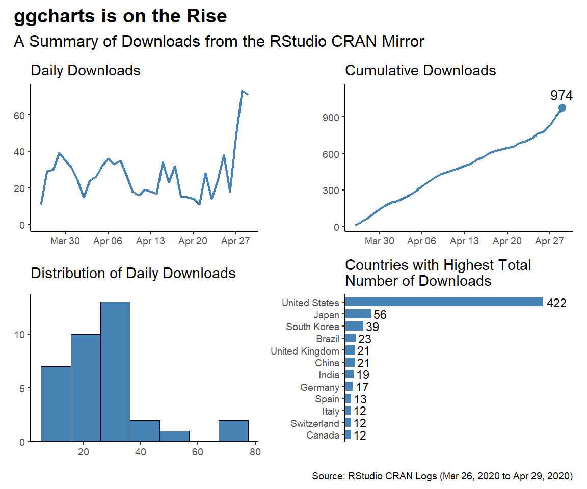

{ggcharts} CRAN Downloads
================

This repo contains the analysis of downloads of my [`ggcharts`](https://thomas-neitmann.github.io/ggcharts/index.html) `R` package. Following the ["analyses as package"](https://rmflight.github.io/posts/2014/07/analyses_as_packages.html) philosophy this repo itself is an `R` package that can installed using `remotes::install_github()`.

Why did I bother to make this a package? Because it forced me to modularize my code rather than having one long script. Almost all functions I use below are part of this package.

While I analyze `ggcharts` here, the function are written in a way that you can analyze any CRAN package.

This file was last updated on May 01, 2020.

``` r
library(ggchartsdownloads)
library(ggplot2)
library(patchwork)
```

``` r
start_date <- as.Date("2020-03-26")
end_date <- Sys.Date() - 2
downloads <- download_logs("ggcharts", start_date, end_date)
daily_downloads <- compute_daily_downloads(downloads)
downloads_by_country <- compute_downloads_by_country(downloads)

p1 <- plot_daily_downloads(daily_downloads)
p2 <- plot_cumulative_downloads(daily_downloads)
p3 <- hist_daily_downloads(daily_downloads)
p4 <- plot_downloads_by_country(downloads_by_country)

f <- function(date) format(date, "%b %d, %Y")
patchwork_theme <- theme_classic(base_size = 24) +
  theme(
    plot.title = element_text(face = "bold"),
    plot.caption = element_text(size = 14)
  )
p1 + p2 + p3 + p4 +
  plot_annotation(
    title = "ggcharts is on the Rise",
    subtitle = "A Summary of Downloads from the RStudio CRAN Mirror",
    caption = glue::glue("Source: RStudio CRAN Logs ({f(start_date)} to {f(end_date)})"),
    theme = patchwork_theme
  )
```


